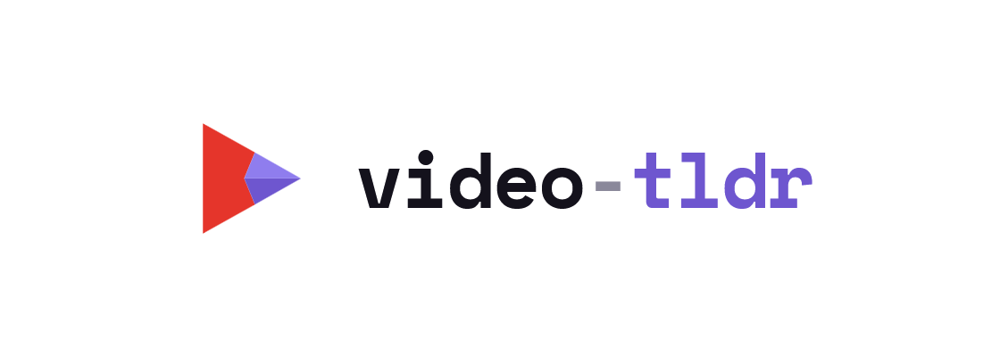

# video-tldr

<p align="center"></p>

**Watch it. Vault it.**

_[English version](../README.md)_

Zu lang zum Lesen? Eine Erweiterung für Firefox und Chrome mit einem
lokalen Dienst, die aus dem YouTube-Video im aktiven Tab eine
Zusammenfassung mit Bildern macht.

## Was es kann

- **Video-Zusammenfassung.** Das Symbol in der Werkzeugleiste öffnet ein
  kleines Fenster mit zwei Knöpfen. „Schnell" und „Gründlich" übergeben
  das Video an einen lokalen Dienst. Der holt Titel, Beschreibung,
  Kapitel und Untertitel, transkribiert den Ton, wenn Untertitel fehlen,
  lässt ein Sprachmodell den Inhalt einordnen und zusammenfassen, zieht
  Standbilder an den sehenswerten Stellen, liest die Kommandos von diesen
  Bildern und die Installationsschritte aus verlinkten
  GitHub-Repositories und schreibt das Ergebnis als Markdown, als Notiz
  in einen Obsidian-Vault mit eingebettetem Video, als PDF und als
  Word-Datei.
- **Was das Fenster zeigt.** Jeden Schritt mit seinen Sekunden, einen
  Fortschrittsbalken und die Restzeit aus früheren Läufen, Modell und
  Transkribierer, das Dienst-Log und Knöpfe, die die Notiz in Obsidian
  oder den Download-Ordner öffnen. Ein zweites Video stellt sich hinten
  an, ein Lauf lässt sich abbrechen. Drei Lampen sagen vor dem Klick, ob
  Dienst, Modell und Transkribierer bereit sind.
- **Schalter je Lauf.** Zeitstempel ins Video, die Kernbotschaft als
  Zwei-Minuten-Lesestück, und die Arbeitsdateien danach löschen. Wie die
  Notiz formuliert ist, ist eine eigene Wahl: normal, knapp, ohne
  Werbewörter, technisch, im Plauderton, oder alle auf einmal zum
  Vergleichen.
- **Wo es läuft.** Das Sprachmodell über die Claude-Code-CLI, die API von
  Anthropic oder OpenAI, LM Studio oder Ollama; die Transkription über
  Whisper, Parakeet, Canary oder OpenAI. Die Einstellungen zeigen, was
  jedes Modell auf deinem Rechner gebraucht hat, und lassen mehrere am
  selben Video gegeneinander antreten.
- **Open all links.** Text markieren, im Kontextmenü „Open all links"
  wählen, und jeder Link in der Markierung öffnet sich als Tab in einem
  neuen Fenster: YouTube-Weiterleitungen ausgepackt, Sponsor- und
  Affiliate-Hosts ausgelassen, einmal geöffnete Links beim nächsten Mal
  übersprungen.

## Installation

Zwei Teile: der Dienst und die Erweiterung, die mit ihm spricht.

Der Dienst kommt aus einem Release. Er braucht
[uv](https://docs.astral.sh/uv/), das sein Python selbst mitbringt. Drei
Wege, nimm den, der dir passt:

```
irm https://raw.githubusercontent.com/corgan2222/video-tldr/main/install.ps1 | iex
uv tool install video-tldr-service
git clone https://github.com/corgan2222/video-tldr.git
```

Das Skript legt den Befehl auf den PATH und wählt die CUDA-Bibliotheken,
wenn eine NVIDIA-Karte im Rechner steckt, sonst die kleinere
ONNX-Laufzeit. `uv tool install` ist kürzer, wenn du uv schon hast. Der
Klon geht ohne jedes Release und ist ohnehin das, was Beitragende wollen.

Einen Autostart trägt das Skript nicht ein. Den Dienst startest du selbst
mit `video-tldr serve`;
antwortet er nicht, zeigt die Erweiterung genau diesen Befehl und eine
Schaltfläche, die ihn kopiert. Mit `-Autostart` legt der Installer
stattdessen eine Aufgabe an, die ihn bei jeder Anmeldung startet;
`video-tldr autostart on|off|status` schaltet das später um.
`-Root D:\video-tldr` legt Programm, Umgebung und Daten unter ein
Verzeichnis statt an drei übliche Orte. Die Sprachmodelle kommen beim
ersten Lauf dazu, mehrere Gigabyte.

Die Erweiterung ist die `.zip` desselben Releases: in Firefox als
temporäres Add-on laden (`about:debugging`, „Dieser Firefox") oder
entpacken und den Ordner in Chrome laden (`chrome://extensions`,
Entwicklermodus).

Bis zum ersten Release beides aus dem Quelltext bauen. Die Erweiterung:

```
npm ci
npm run build
```

Dann `dist/` laden. Der Dienst liegt in
[`service/`](../service/README.md); dessen README beschreibt Einrichtung
und Modellwahl.

## Benutzung

1. Dienst starten: `video-tldr serve`, aus dem Quelltext gebaut
   `uv run --project service video-tldr serve`.
2. Auf das Symbol klicken, „Settings" öffnen, „Connect" drücken, Sprache,
   Ausgaben und Modell wählen, „Save". Ein Token braucht es nur, wenn der
   Dienst eines bekommen hat.
3. Ein YouTube-Video öffnen, auf das Symbol klicken, „Fast" oder
   „Thorough" drücken. Das Fenster zeigt die Schritte, während sie
   laufen; eine Benachrichtigung meldet, wenn die Zusammenfassung fertig
   ist, und ein Klick darauf öffnet die Notiz.
4. Ohne Browser: `video-tldr run <url>` macht dasselbe von der
   Kommandozeile.

---

Diese Datei ist für Nutzer geschrieben. Beitragende lesen die englischen
Dateien: [CONTRIBUTING.md](../CONTRIBUTING.md), Lizenz in
[LICENSE](../LICENSE).
